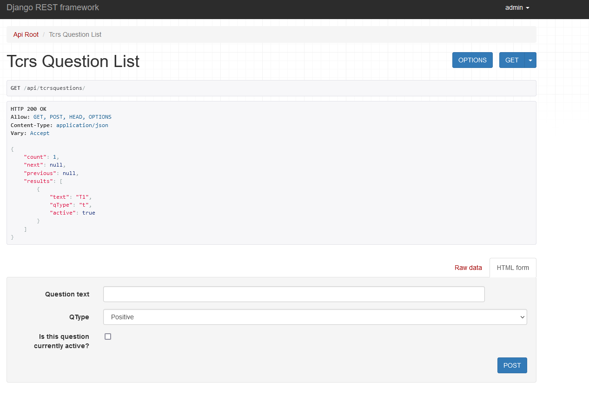
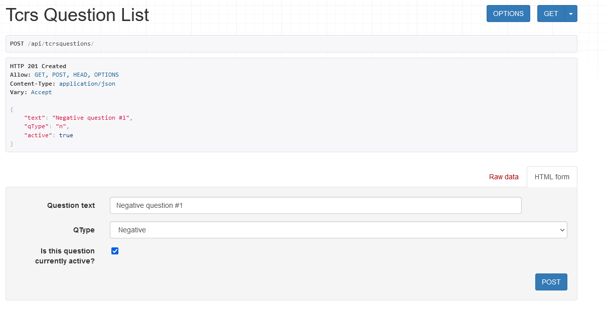
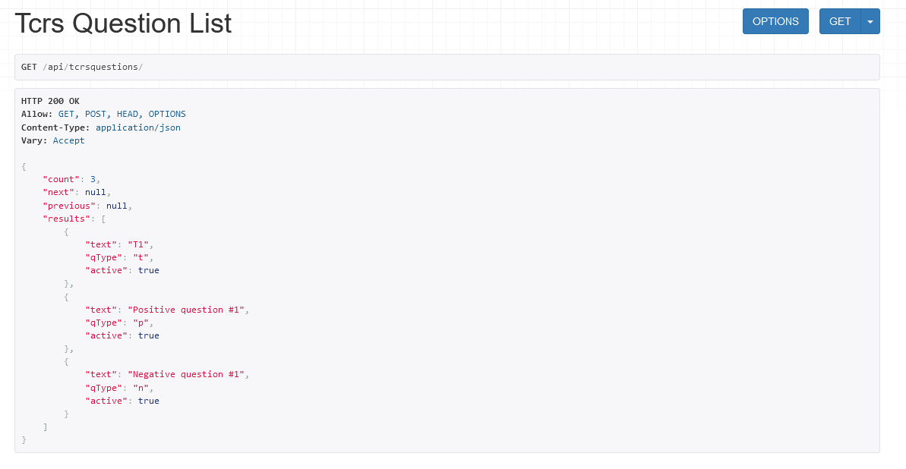
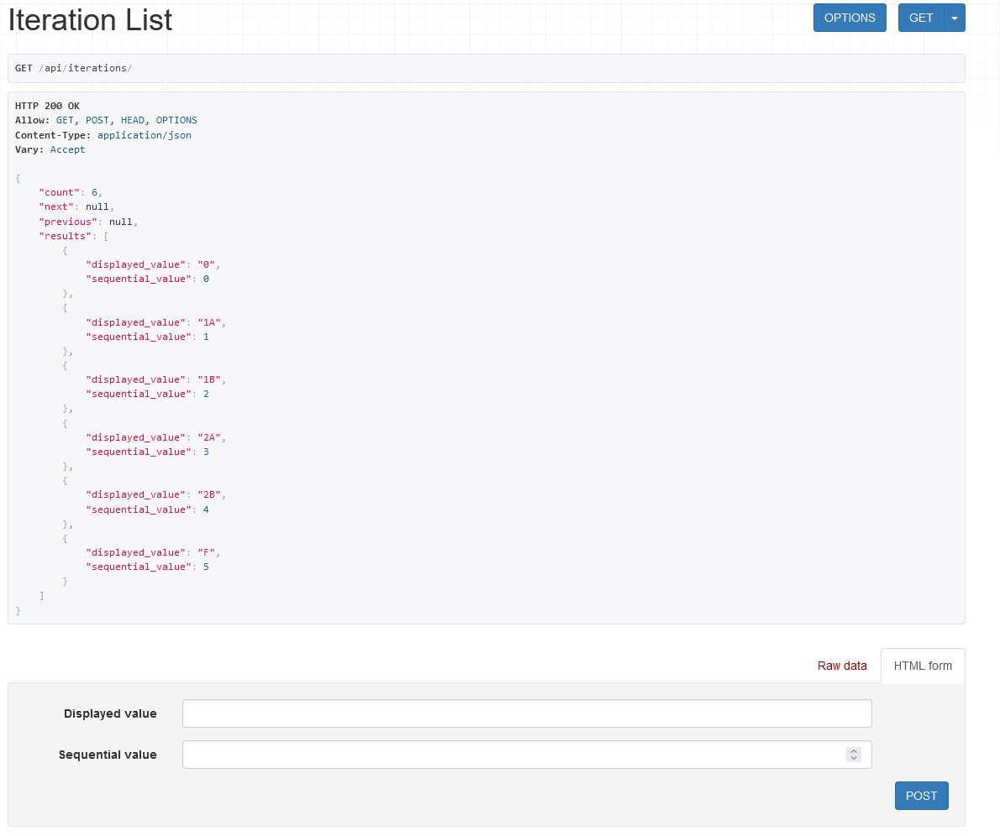
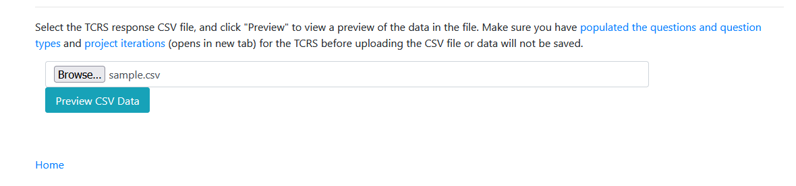
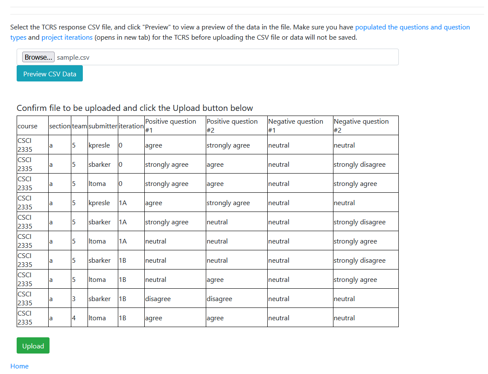
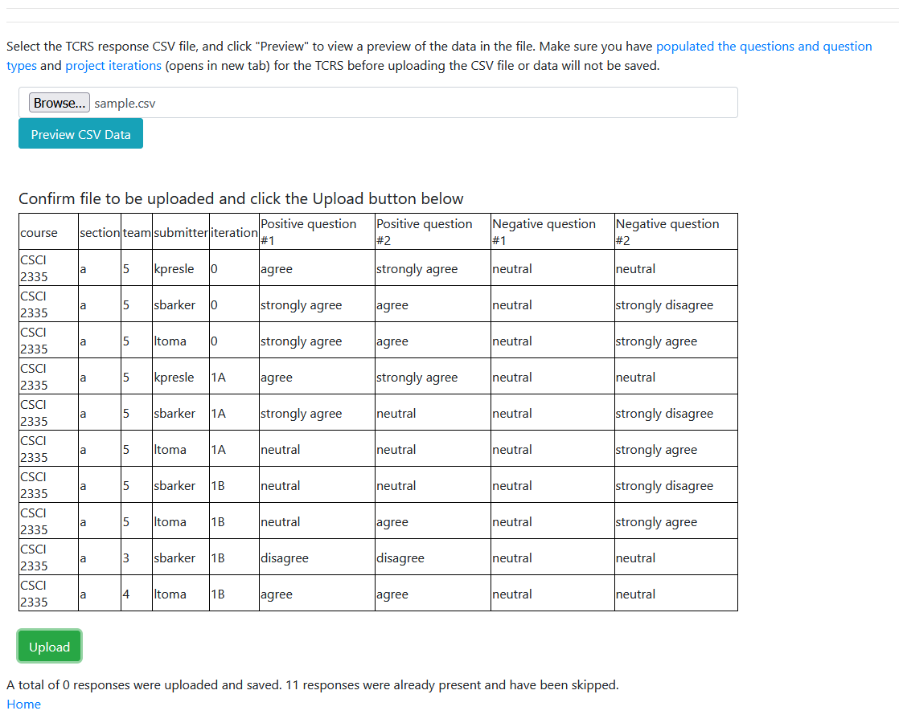

# teamtracking

A Django web application for tracking team challenges in software engineering courses.  This project is built around the [Team Collaboration Reflection Survey](https://dl.acm.org/doi/abs/10.1145/3478431.3499367) from Kai Presler-Marshall, Sarah Heckman, and Kathryn Stolee.


## Requirements

* Python 3.10 (tested with Python 3.10.5)


## Features


## Setup

Setup is pretty standard for a Python Django application:

* Create a Python virtual environment: `python[3] -m venv env/`
* Activate Python virtual environment: `source env/Scripts/activate`
* Install dependencies: `python[3] -m pip install -r requirements.txt`
* Setup NLTK dependencies: `python[3] prepare.py`
* Create database: `python[3] manage.py migrate`
* Create admin user: `python[3] manage.py createsuperuser` (credentials are up to you, just, don't forget them :) )
* Run application server: `python[3] manage.py runserver`


## First Run

This application is built around the Team Collaboration Reflection Survey (TCRS) we introduced in prior work, but is designed to allow greater flexibility for you to use the TCRS as you see fit.  Consequently, there is some data you must create before the application will be functional.

To start, navigate to `your_server_ip:8000`.

### Authenticate

All Django REST API endpoints require authentication.  Click the `Login` link on the main page and sign in with your admin credentials created in the previous step.

### Create TCRS Questions

In our original work, we proposed a set of TCRS questions that worked effectively in our context.  However, we reconigse that in different contexts, a different set of questions may be more sensible.  Consequently, you must define the questions that your specific version of the TCRS uses.  From the main page, click the **Initialise TCRS Questions** link:



All questions have three components:

* `Question Text`: As expected, this is the text of the question, which will be both displayed to the user through the web application, and, when loading TCRS submissions, used to match against the CSV file uploaded.  Make sure this matches exactly against what is in your CSV file, but otherwise it can be any value you want.
* `QType` (Question Type): Four different types of questions are supported.  `Positive` questions are Likert-scale questions where we would expect a team that is functioning successfully to answer "Agree" or "Strongly agree".  `Negative` questions are the reverse: ones where we would expect a team that is functioning successfully to answer "Disagree" or "Strongly disagree".  `Text` questions are open-ended questions that should be natural-language processed to indicate success or dysfunction.  `Other` questions are ones that are excluded from analysis, and ask f.ex what a student has been working on over the past week.
* `Currently Active`.  You may choose to deactive a question, but want to keep around responses that use it for further analysis.  Questions should be marked "Active" when first created, and can then be deactivated later if desired.

Creating a new question will show it:



You can then view all questions at `server_ip:8000/api/tcrsquestions`:



### Define Project Iterations

This application is designed for tracking team challenges across _multi-week_ projects.  Thus, a core component is the idea of _Project Iterations_.  Iterations can be whatever length you want -- one week, three weeks, four days, etc, but must be explicitly defined.  Click the **Initialise Iterations** link from the main page.  Iterations have two parts:

* A _display value_.  This is the value you want to see on the web application, and the value that will be present within the TCRS responses you want to manage.  This value can be anything that you want, but must be consistently used across all TCRS submissions.
* A _sequential value_.  This keeps track of how iterations are arranged sequentially (ie, Iteration 0, Iteration 1A, Iteration 1B, Iteration 2A, etc).  This value can be indexed from any starting value you want (0, 1, -357, you get the idea) but must be sequential.  


You can then view all iterations at `server_ip:8000/api/iterations`:



## Use

### Loading Responses

After defining TCRS Questions and Project Iterations, you are now prepared to load in TCRS responses.  Click the **Load TCRS Submissions** link from the main page:



This step takes a **CSV file** of TCRS responses, which can be exported f.ex from Qualtrics, Google Forms, etc, depending on how you use the TCRS.  The following columns are expected:

* `course`: Name/number of the course.  Can be full name ("Software Engineering"), prefix+number ("CSCI 2335"), or anything else, so long as it is used consistently.

* `section`: Course section.  Text or number supported.

* `team`: Team name or number.  This does *not* need to be unique across sections (ie, you can have Section 1, Team 5, and Section 2, Team 5, and they will be treated a distinct)

* `submitter`: Who submitted the TCRS response.  This can be a student's name, ID number, email address, etc so long as it is used consistently.

* `iteration`: Corresponds to one of the Iterations created above.  The value here must match **exactly** to the Display Value entered when creating the Iteration.

Note that these five columns alone don't make for a very interesting response, as they have on their own not asked students to reflect on anything, so there is no information on how effectively a team is collaborating.  You can then have **any number** of columns you want corresponding to individual TCRS questions.  For example, with four questions, your TCRS header might look like:
```
course,section,team,submitter,iteration,Positive question #1,Positive question #2,Negative question #1,Negative question #2
```

Note that the TCRS questions in your CSV file should match against the questions defined previously, but the system does not enforce this.  Any questions present in the TCRS CSV file that are not known by the system will be skipped over, as will any known to the system that are not present in the CSV file.  Thus, it is possible to have possible questions tracked by the system that are not in a specific TCRS CSV upload.

After selecting a CSV file, click Preview CSV Data, and the first ten rows of the file will be shown:



If everything looks OK, click Upload.  Otherwise, double-check the CSV file and try again:



Responses that were already present in the system will be skipped over.  All new responses will be uploaded.  A response is defined as "duplicate" if a response with the same 5-tuple (course, section, team, submitter, iteration) already exists.

### Viewing Teams